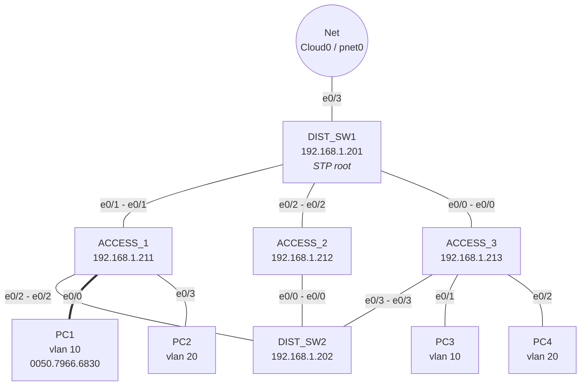
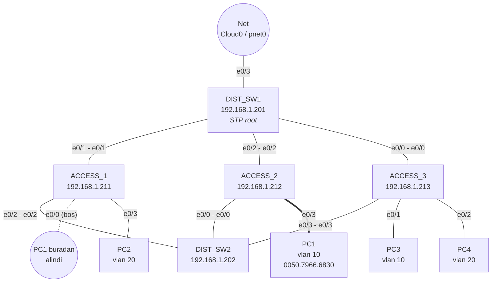

# mac_tracker

Ag uzerindeki bir cihazin **hangi switch'in hangi portunda** oldugunu SNMP ile
bulur, kaydeder; cihaz portundan koptuysa **en son ne zaman aktif oldugunu**
gecmise donuk soyler.

Kayip/calinmis laptop, "bu IP'yi kim kullaniyordu", "bu cihaz hangi portta
takiliydi" tipi sorular icin.

Elinde MAC degil IP varsa: gateway'lerin ARP tablosu da toplanir, boylece
`--lookup-ip 10.10.10.20` zinciri tamamlar -> IP'den MAC'e, MAC'ten switch
portuna.

## Nasil calisir

Her poll'da her switch'in MAC adres tablosu (FDB) okunur ve her MAC icin
`switch + port + VLAN` kaydi tutulur. **Ayni MAC ayni portta tekrar
gorulurse yeni satir acilmaz**, sadece o kaydin `last_seen` alani guncellenir:

* Veritabani cihaz sayisi kadar buyur, poll sayisi kadar buyumez.
* Cihaz agdan koptugunda `last_seen` oldugu yerde donar -> **"en son ne zaman
  bu portta aktifti"** cevabi tam olarak budur.
* Cihaz port degistirirse bu hareket `mac_moves` tablosuna yazilir.

ARP tarafi ayni mantikla calisir: gateway'in ARP tablosundaki her IP -> MAC
eslemesi icin tek satir tutulur, esleme degismedikce `last_seen` guncellenir.
IP baska bir MAC'e gecerse (DHCP yeniden dagitimi, cihaz degisimi) yeni satir
acilir ve eskisi gecmis olarak kalir.

```
switch (SNMP/SSH) --> mac_tracker.py --> mac_tracker.db (SQLite dosyasi)
router (SNMP/SSH) -->                       mac_locations : mac + switch + port + first_seen/last_seen
                                            mac_moves     : port degisiklikleri
                                            arp_sightings : ip + mac + kaynak cihaz + first_seen/last_seen
                                            poll_runs     : her cihazin her poll sonucu (kind=mac|arp)
```

Zincir:

```
IP --(gateway'in ARP tablosu)--> MAC --(switch FDB'si)--> switch + port
```

ARP router'i **asmaz**; tek yaptigi IP'yi MAC'e cevirmektir. Cihazin portunu
bulabilmek icin cihazin kendi segmentindeki switch de envanterde olmalidir.

## Kurulum

```bash
# 1) SNMP yolu icin net-snmp (snmpbulkwalk varsa otomatik secilir)
sudo apt install snmp                 # Linux
# Windows: https://www.net-snmp.org/  ya da  choco install net-snmp

# 1b) SSH yolu icin (--collector ssh)
pip3 install paramiko                 # ya da: apt install python3-paramiko

# 2) Envanter
cp inventory.csv.example inventory.csv
$EDITOR inventory.csv

# 3) Test (ag gerektirmez, 90 test)
python3 mac_tracker.py --selftest
```

**Surum sartlari**

| Bilesen | Gereken | Neden |
|---|---|---|
| Python | **3.7+** (3.8+ onerilir) | dataclasses, `subprocess.run(capture_output=)`, `datetime.fromisoformat` |
| SQLite | **3.24+** | UPSERT (`ON CONFLICT ... DO UPDATE`) -- Python'un kendi `sqlite3` modulunden gelir |
| paramiko | sadece `--collector ssh` icin | SNMP yolu harici paket istemez |

Surumleri kontrol et:

```bash
python3 --version
python3 -c "import sqlite3; print(sqlite3.sqlite_version)"
```

> Dikkat: Ubuntu 16.04 tabanli sistemler (ornegin bazi EVE-NG surumleri)
> Python 3.5 ve SQLite 3.11 ile gelir; script orada **calismaz**. Toplayiciyi
> baska bir makinede calistir -- switch'e IP erisimi olmasi yeterli.

SQLite ayri bir servis degil, sadece bir dosya: `--db` ile verdigin dosya
yoksa tablolariyla birlikte otomatik olusturulur.

Switch tarafinda gereken tek sey read-only SNMP erisimi:

```
! Cisco IOS - v2c
snmp-server community <RO-STRING> RO 10
access-list 10 permit <toplayici-ip>

! Cisco IOS - v3 (onerilen)
snmp-server group RO-GRP v3 priv
snmp-server user mactrack RO-GRP v3 auth sha <AUTH-PASS> priv aes 128 <PRIV-PASS>
```

## Kullanim

### Veri toplama

```bash
# Ilk deneme (ayrintili cikti, hatalari gormek kolay)
python3 mac_tracker.py --once -v

# ONERILEN: cron / Task Scheduler ile her dakika. Her calisma bagimsiz oldugu
# icin biri kacsa sonraki devam eder; uyuyan laptop / kopan ag loop'u sessizce
# oldurmez.
*/1 * * * * /usr/bin/python3 /opt/mac_tracker/mac_tracker.py --once --db /var/lib/mac_tracker.db --inventory /opt/mac_tracker/inventory.csv

# Tek process isteniyorsa
python3 mac_tracker.py --loop --interval 60
```

### Sorgulama

```bash
# Cihaz nerede / koptuysa en son ne zaman aktifti
python3 mac_tracker.py --lookup aabb.ccdd.eeff      # Cisco formati da olur
python3 mac_tracker.py --lookup AA:BB:CC:DD:EE:FF

# Tum konum gecmisi + port degisiklikleri
python3 mac_tracker.py --history AA:BB:CC:DD:EE:FF

# Elinde MAC degil IP varsa (envanterde role=router bir cihaz sart)
python3 mac_tracker.py --lookup-ip 10.10.10.20
python3 mac_tracker.py --ip-history 10.10.10.20

# Bir portta / bir switch'te neler gorulmus
python3 mac_tracker.py --port Gi1/0/5
python3 mac_tracker.py --port Gi1/0/5 --switch Kat1-SW
python3 mac_tracker.py --list-switch Kat1-SW

# 7 gunden beri hic gorulmeyen cihazlar (kayip cihaz listesi)
python3 mac_tracker.py --stale 7

# DB ve switch durumu ozeti / bakim
python3 mac_tracker.py --summary
python3 mac_tracker.py --prune 365
```

Ornek `--lookup` cikisi:

```
MAC          : AA:BB:CC:DD:EE:FF
Durum        : KOPMUS (bu portta son aktiflik: 3 gun 0 saat once)
Switch       : Kat1-SW (10.1.1.1)
Port         : Gi1/0/9
VLAN         : 10
IP           : 10.10.10.20  (ARP: Gateway-RTR, 3 gun 0 saat once)
Ilk gorulme  : 2026-09-07 21:10:48 +0300
Son gorulme  : 2026-09-07 21:10:48 +0300  (3 gun 0 saat once)
Gorulme sayisi: 1 poll
Portta MAC   : 1
```

`Durum` uc deger alir:

| Durum | Anlami |
|---|---|
| `AKTIF` | Son basarili poll'da bu portta goruldu |
| `KOPMUS` | Switch sorgulanabiliyor ama cihaz artik FDB'de yok -> `Son gorulme` gercek kopma zamanidir |
| `BILINMIYOR` | Switch'e ulasilamiyor; cihaz hakkinda yorum yapilamaz (cihaz kopmasi ile switch kopmasi karistirilmaz) |

### IP ile arama (ARP)

ARP tablosu **yalnizca o subnet'in gateway'inde** olusur: L2 switch'ler IP
gormez. Bu yuzden IP ile arama yapabilmek icin gateway'i (router ya da SVI'si
olan L3 switch) envantere `role=router` ile eklemek gerekir:

```csv
switch,community,vlans,label,version,role
10.1.1.1,public,,Kat1-SW,2c,switch
10.1.0.1,public,,Core-L3,2c,both
10.1.0.254,public,,Gateway-RTR,2c,router
```

| role | Cihazdan ne okunur |
|---|---|
| `switch` | **Varsayilan.** MAC adres tablosu (FDB): cihaz hangi portta |
| `router` | ARP tablosu: hangi IP hangi MAC'te |
| `both` | Ikisi birden -- SVI'si olan bir L3 switch icin |

Toplama tarafinda ek bir komut yok; `--once` / `--loop` her iki tabloyu da
role'e gore okur:

```
[ACCESS_1] ssh: 4 MAC kaydedildi
[Gateway-RTR] arp-ssh: 11 IP->MAC eslemesi kaydedildi
Poll bitti: 5/5 switch ok, 12 MAC kaydi, 3 uplink kaydi atlandi; ARP: 1/1 cihaz ok, 11 IP->MAC
```

Ornek `--lookup-ip` cikisi -- once ARP, sonra konum:

```
IP           : 10.10.10.20
MAC          : 00:50:79:66:68:01
ARP kaynagi  : Gateway-RTR Vlan10  (az once)

MAC          : 00:50:79:66:68:01
Durum        : AKTIF (son pollde bu portta goruldu)
Switch       : ACCESS_2 (192.168.1.212)
Port         : Et0/3
VLAN         : 10
...
```

ARP okumasi da `--collector` ayarini takip eder: `snmp` yolunda IP-MIB
`ipNetToMediaPhysAddress` (tek walk, VLAN context'i gerektirmez), `ssh`
yolunda `show ip arp`. Parse edici IOS, IOS-XE ve NX-OS ciktilarini tanir;
`Incomplete` kayitlar atlanir (cozulememis bir ARP istegi, o IP'de bir cihaz
oldugu anlamina gelmez). Komut gerekirse degistirilebilir:
`--ssh-arp-command "show ip arp vrf MGMT"`.

Iki sinir:

* ARP router'i asmaz. Uzak bir subnet'teki cihaz icin o subnet'in gateway'i
  de envanterde olmalidir.
* ARP kaydi bir IP'yi MAC'e cevirir, portu vermez. MAC hicbir switch'in
  FDB'sinde yoksa `--lookup-ip` bunu acikca soyler -- cihazin segmentindeki
  switch envante disindadir.

Bir IP zaman icinde birden fazla MAC'te gorulduyse (DHCP havuzu) hepsi
saklanir:

```bash
python3 mac_tracker.py --ip-history 10.10.10.20
```

## Onemli detaylar

**Veri kaynagi (`--collector`)**

| Kaynak | Anlami |
|---|---|
| `snmp` | **Varsayilan.** FDB'yi SNMP ile okur (asagidaki `--mode`). |
| `ssh` | Cihaza SSH ile baglanip `show mac address-table` ciktisini parse eder. VLAN + MAC + port tek komutta gelir, MIB destegine ihtiyac yoktur. `pip3 install paramiko` gerekir. |

Secim ARP tarafini da belirler: `snmp` -> `ipNetToMediaPhysAddress`,
`ssh` -> `show ip arp`.

SSH yolu ne zaman gerekir: bazi platformlarda -- ozellikle EVE-NG/GNS3'teki
**IOL/IOU imajlari** -- Q-BRIDGE MIB yoktur, Cisco'nun `community@vlan`
indexlemesi calismaz ve VLAN context'leri de yoktur. Bu durumda SNMP ile
VLAN basina FDB okumak mumkun olmaz; `--collector ssh` calisan tek yoldur.
Gercek Catalyst/Nexus'ta SNMP yolu tercih edilir (daha hafif, kimlik
bilgisi yonetimi daha basit).

```bash
# Switch'te SSH acik olmali:
#   ip domain-name lab.local
#   crypto key generate rsa modulus 1024
#   username admin privilege 15 secret <parola>
#   line vty 0 4 / login local / transport input ssh

export MACTRACK_SSH_PASS='...'
export MACTRACK_SSH_ENABLE='...'          # gerekiyorsa enable parolasi
python3 mac_tracker.py --once -v --collector ssh --ssh-user admin

# Eski IOS'larda komut tireli:
python3 mac_tracker.py --once --collector ssh --ssh-user admin --ssh-command "show mac-address-table"
```

Parse edici IOS, IOS-XE ve NX-OS ciktilarini tanir; yalnizca `DYNAMIC`
kayitlari alir (`STATIC`/`CPU`/`sup-eth1` gibi satirlar bir cihazin o portta
oldugu anlamina gelmez). Bu yol EVE-NG'deki gercek bir Cisco IOL switch'inde
ucdan uca dogrulandi -- ayrintilar icin **Dogrulanmis ortamlar** bolumu.

**MAC tablosu okuma yontemi (`--mode`, sadece `--collector snmp`)**

| Mod | Anlami |
|---|---|
| `dot1q` | Standart Q-BRIDGE MIB (`dot1qTpFdbPort`). VLAN, OID index'inde geldigi icin **tek walk tum VLAN'lari** verir. Marka bagimsiz ve hizli. |
| `dot1d` | Klasik BRIDGE MIB. VLAN tasimadigi icin VLAN basina ayri sorgu: Cisco'da v2c `community@vlan`, v3'te `vlan-<id>` context. Eski Catalyst'ler icin. Envanterde `vlans` sart. Bridge-port -> ifIndex haritasi da VLAN context'ine bagli oldugu icin her VLAN'da ayri okunur. |
| `auto` | **Varsayilan.** Once `dot1q`, bos donerse `dot1d`. |

**Uplink/trunk portlari.** Bir cihazin MAC'i kendi access portunda gorundugu
gibi aradaki tum switch'lerin uplink portlarinda da gorunur. "Cihaz hangi
portta" cevabinin dogru olmasi icin tek portta `--uplink-threshold`
degerinden (varsayilan 10) fazla MAC varsa o port trunk kabul edilip
kaydedilmez. Hepsini kaydetmek icin `--keep-uplinks`.

**Sadece ogrenilmis kayitlar.** `dot1qTpFdbStatus`/`dot1dTpFdbStatus`
okunur, yalnizca `learned(3)` kaydedilir; switch'in kendi MAC'i (`self`) ve
statik kayitlar cihaz sayilmaz. Bir walk tasarrufu icin
`--no-status-filter` ile kapatilabilir.

**"Son aktiflik" ne kadar hassas?** FDB kaydi, MAC aging-time suresince
(Cisco varsayilani 300 sn) tabloda kalir. Yani `last_seen`, son paketten
aging-time kadar ileride olabilir. 60 saniyelik poll araligi pratikte
yeterli hassasiyeti verir.

**Zaman damgalari.** DB'ye her zaman UTC yazilir (`2026-09-10T20:54:01Z`),
boylece metin siralamasi = kronolojik siralama olur (yaz saati degisimi
siralamayi bozamaz). Ekranda yerel saate cevrilerek gosterilir.

**Guvenlik.** Envanterdeki community string'i duz metindir; `inventory.csv`
`.gitignore`'da ve dosya izinlerini sikilastirmak iyi olur
(`chmod 600 inventory.csv`). SNMPv3 icin sifreyi komut satirina yazmak yerine
ortam degiskeni kullan:

```bash
export SNMP_V3_USER=mactrack
export SNMP_V3_AUTH_PASS='...'
export SNMP_V3_PRIV_PASS='...'
python3 mac_tracker.py --once          # envanterde ilgili satirlarda version=3
```

**Performans.** Switch'ler paralel sorgulanir (`--workers`, varsayilan 8);
DB yazimi tek thread'de ve switch basina tek transaction icinde yapilir.
Walk icin `snmpbulkwalk` varsa otomatik secilir.

## Testler

```bash
python3 mac_tracker.py --selftest              # ya da
python3 -m unittest discover -s tests -t . -v
```

90 test; hicbiri gercek switch gerektirmez. SNMP katmani sahte `snmp_walk`
ile, SSH katmani sahte `ssh_fetch_mac_table` / `ssh_fetch_arp_table` ile,
veritabani katmani `:memory:` DB ile test edilir. `show mac address-table` ve
`show ip arp` parse testleri gercek cihaz ciktilarindan alinmis fixture'lar
kullanir (IOS/IOL, IOS-XE, NX-OS).

## Dogrulanmis ortamlar

| Ortam | Yol | Sonuc |
|---|---|---|
| Cisco IOL (L2), EVE-NG -- tek switch | `--collector ssh` | Calisiyor -- toplama, AKTIF/KOPMUS durumu, UPSERT davranisi ucdan uca dogrulandi |
| Cisco IOL (L2), EVE-NG -- 5 switch (2 dist + 3 access, cift baglantili, STP'li) | `--collector ssh` | Calisiyor -- paralel toplama, uplink/trunk eleme, access portunun trunk'i yenmesi, cihazi baska switch'e tasiyinca **tek** hareket kaydi uretilmesi dogrulandi |
| Cisco IOL (L2), EVE-NG | `--collector snmp` | **Calismiyor** -- imajda Q-BRIDGE MIB yok, `community@vlan` indexlemesi yok, VLAN context'i yok |
| ARP toplama (`role=router`) | `--collector ssh` / `snmp` | **Labda henuz dogrulanmadi.** Test topolojisi saf L2; ARP tablosunun olusmasi icin once VLAN 10/20 icin SVI + `ip routing` tasiyan bir router ya da L3 switch eklenmeli. Parse tarafi gercek cihaz cikti formatlariyla test edildi, ucdan uca akis degil. |

IOL'de SNMP ile ogrenilenler (gercek Catalyst'te bunlarin cogu gecerli degildir,
ama benzer kisitli platformlarda ise yarar):

* `dot1qTpFdbPort` (Q-BRIDGE) → `No Such Instance`, tablo hic yok.
* `public@10` gibi VLAN indexli community → **timeout**; agent bu sozdizimini
  tanimadigi icin istegi sessizce dusuruyor. `public@1` bile cevapsiz.
* Varsayilan community VLAN 1 context'ine denk geliyor. VLAN 1 bos oldugunda
  `dot1dTpFdbPort` de `No Such Instance` doner -- bu "MIB yok" demek degildir.
* `dot1dBasePortIfIndex` **de VLAN context'ine baglidir**: varsayilan community
  yalnizca VLAN 1'in portlarini verir ve bridge-port numaralari VLAN'dan
  VLAN'a degisebilir. Bu yuzden dot1d modunda harita, FDB ile ayni VLAN
  context'i icinde okunur (aksi halde port adi `bridgeport<N>` olarak kalirdi).

### Test topolojisi

Iki dagitim + uc erisim switch'i, her erisim switch'i iki dagitim switch'ine de
bagli (yani kapali dongu var, STP bir tarafi blokluyor). Yonetim VLAN 99
uzerinden, DIST_SW1'in `e0/3` portundaki bulut ile toplayici makineye cikiyor.

**Baslangic durumu** -- PC1, ACCESS_1 `Et0/0`'da:



**Tasima sonrasi** -- PC1 ayni VLAN'da kalarak ACCESS_2 `Et0/3`'e alindi:



5 switch'lik lab'da bir PC `ACCESS_1 Et0/0`'dan `ACCESS_2 Et0/3`'e tasindiginda
uretilen `--history` ciktisi, aracin varlik sebebini ozetliyor:

```
SWITCH      PORT     VLAN  ILK GORULME                SON GORULME                POLL
ACCESS_2    Et0/3      10  2026-09-11 02:34:03 +0300  2026-09-11 02:34:03 +0300     1
ACCESS_1    Et0/0      10  2026-09-11 02:21:19 +0300  2026-09-11 02:24:37 +0300     2
DIST_SW1    Et0/1      10  2026-09-11 02:24:37 +0300  2026-09-11 02:24:37 +0300     1

Port degisiklikleri (1):
  2026-09-11 02:34:03 +0300  ACCESS_1 Et0/0  ->  ACCESS_2 Et0/3
```

Ikinci satirdaki `SON GORULME`, cihazin eski portunda **en son ne zaman aktif
oldugu**dur. Ucuncu satir DIST_SW1'in trunk'inda birakilan izdir; bu testte
`--uplink-threshold 2` gibi agresif bir esik kullanildigi ve o an trunk'ta az
MAC oldugu icin elenmemistir -- gercek agda varsayilan 10 bunu temizler.

**Aging suresi.** Bir MAC, cihaz susunca aging-time (Cisco varsayilani 300 sn)
sonunda FDB'den dusar. Lab'da poll'lar arasinda cihaz sessiz kalirsa "kayit yok"
gorursun -- bu araç hatasi degil, switch'in tablosu gercekten bos. Lab testlerini
deterministik yapmak icin:

```
switch(config)# mac address-table aging-time 1800
```

## Sorun giderme

| Belirti | Sebep / cozum |
|---|---|
| `% Invalid input detected` (switch'te) | `snmpwalk` bir IOS komutu degil. SNMP/SSH komutlari **toplayici makinede** calisir, switch'te sadece `snmp-server community` / SSH yapilandirilir. |
| `snmpwalk: invalid option -- '0'` | `-Onq` icindeki ilk karakter buyuk **O** harfidir, sifir degil. |
| snmpwalk kendi yardim metnini basiyor | Argumanlardan biri bos; genelde `$SW` degiskeni o oturumda tanimli degil (`echo $SW` ile bak) ya da IP ile OID arasinda bosluk yok. |
| `Timeout: No Response` | IP erisimi, community/ACL ya da (VLAN indexli sorgularda) agent'in `@vlan` sozdizimini hic tanimamasi. |
| `Unknown user name` (v3) | Cihaz cevap veriyor ama kullanici tanimli degil. `show snmp user` ile bak -- `snmp-server user` satiri `show run`'da **gorunmez**. |
| Ping calismiyor ama az once eklenen IP'ye ping calisiyor | Kendi makinene atadigin IP'ye ping paketi kutudan cikmaz (~0.02 ms). Gercek testte sure ms mertebesinde ve TTL cihaza gore olur. |
| `Envanter okunamadi: ... switch satiri bulunamadi` | CSV tek satira yapismis. PowerShell'de satir sonu icin backtick (`` `n ``) gerekir; en saglami: `Set-Content -Encoding ascii inventory.csv @("switch,community,vlans,label","10.1.1.1,,,SW1")` |
| `MAC tablosu bos ya da anlasilamadi` (ssh) | Komut kabul edilmemis olabilir: `--ssh-command "show mac-address-table"` (tireli) dene. Router'da MAC tablosu yoktur, envantere sadece switch/L3 switch koy. |
| Cihaz switch'te gorunuyor ama `--lookup` bulmuyor | DB ancak yeni bir poll'da guncellenir; once `--once` calistir. |
| `--lookup-ip` "ARP kaydi yok" diyor | O subnet'in gateway'i envanterde `role=router` (ya da `both`) ile tanimli mi? L2 switch'te ARP tablosu yoktur. Bir de ARP kaydi ancak gateway o IP ile konustuysa olusur -- cihaza ping atip poll'u tekrarla. |
| `--lookup-ip` MAC'i buluyor ama portu bulmuyor | ARP router'i asmaz: cihazin kendi segmentindeki switch de envanterde olmali ve basarili pollenebilmeli. `--summary` ile o switch'in poll durumuna bak. |
| `ARP tablosu bos ya da anlasilamadi` (ssh) | Cihazda ARP tablosu gercekten bos olabilir (L2 switch'e `role=router` verilmis). VRF kullaniliyorsa: `--ssh-arp-command "show ip arp vrf <ad>"`. |

## Tum secenekler

```bash
python3 mac_tracker.py --help
```
